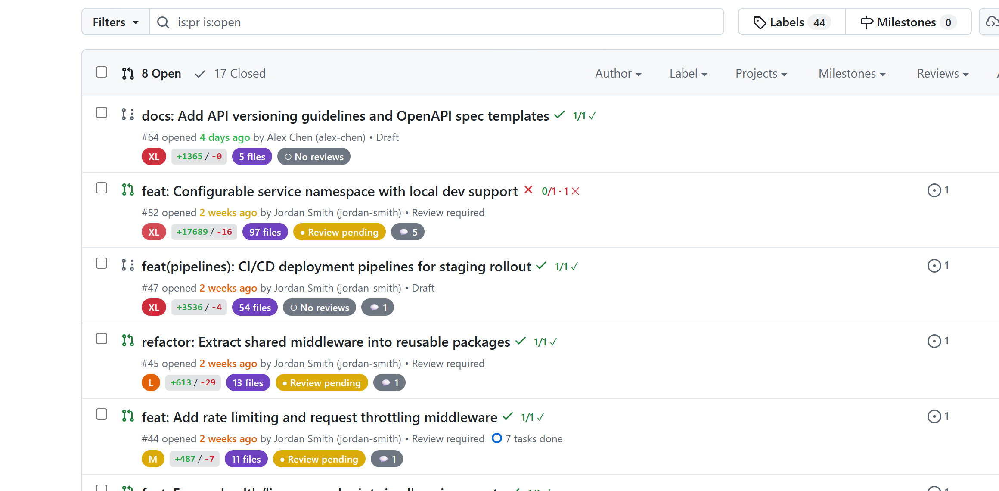

# GitHub PR Enhancer — Chrome Extension

A Chrome extension that enhances GitHub's Pull Request list pages with useful at-a-glance information.



## Features

| Badge | Description |
|-------|-------------|
| **Size Label** | `XS` / `S` / `M` / `L` / `XL` color-coded badge based on total lines changed |
| **Diff Stats** | `+additions / -deletions` inline display |
| **Files Changed** | Number of files touched by the PR |
| **Age Indicator** | Color-coded relative time (green → red as the PR ages) |
| **Draft Badge** | Indicates draft PRs |
| **Review Status** | ✓ Approved / ✕ Changes requested / ● Pending — with reviewer names on hover |
| **CI Status** | ✓ Passed / ✕ Failed / ◔ Pending — combined check runs & statuses |
| **Merge Conflicts** | ⚠ Warning badge when the PR has merge conflicts or is blocked |
| **Branch Staleness** | ↓ Shows how many commits behind the base branch |
| **Review Requested** | 👁 Highlights PRs where *you* are a requested reviewer (blue left border) |
| **Comment Count** | 💬 Number of review comments on the PR |

### Size Thresholds

| Size | Lines Changed |
|------|---------------|
| XS   | < 10          |
| S    | < 100         |
| M    | < 500         |
| L    | < 1,000       |
| XL   | ≥ 1,000       |

## Setup

### Prerequisites

- [Bun](https://bun.sh) (v1.0+)

### Install & Build

```bash
bun install
bun run build
```

### Load in Chrome

1. Open `chrome://extensions/`
2. Enable **Developer mode** (top right)
3. Click **Load unpacked**
4. Select the `dist/` folder

### Configure (Optional)

Click the extension icon and enter a **GitHub Personal Access Token** to increase the API rate limit from 60 to 5,000 requests/hour. The token needs `repo` scope for private repositories.

## Development

```bash
bun run build          # one-off build
```

### Project Structure

```
src/
├── content.ts         # Content script injected into PR list pages
├── background.ts      # Service worker handling GitHub API calls
├── popup.ts           # Extension popup for token configuration
├── styles.css         # Injected styles for PR enhancements
└── utils/
    └── pr-helpers.ts  # PR size calculation, date formatting, colors
build.ts               # Bun build script
manifest.json          # Chrome Manifest V3
popup.html             # Popup UI
```

## How It Works

1. The **content script** runs on `github.com/*/pulls` pages
2. It detects PR rows in the DOM and extracts PR numbers
3. For each PR, it fetches `/{owner}/{repo}/pull/{n}/files` as JSON (same-origin, using session cookies — no token required)
4. The JSON response contains accurate `diffSummaries` with per-file line counts, plus PR metadata
5. CI status, review state, and draft status are read directly from the existing list page DOM
6. Badges are injected into each PR row
7. A `MutationObserver` handles dynamic page updates (GitHub uses Turbo navigation)

## License

MIT
